# GENGA MOVIE DESKTOP APP

**Genga Movie Desktop App** is an exclusive desktop application for aggregating media metadata and streaming playback. It integrates local scraping servers, API resolvers, and web player wrappers inside a unified, feature-rich interface.

---

## 🎯 Project Scope

### What this is
-   A **metadata aggregator** that pulls info from MovieBox, Anilist & MegaPlay, and YTS.
-   A **playback controller** that delegates streaming to embedded players or local proxies.
-   A **desktop application shell** running under Electron wrapping local python and node servers.

### What this is not
-   A content hosting platform.
-   A video distribution service.
-   A commercial product.

---

## ✨ Key Features

### Navigation & UI
-   **Unified Sidebar**: Vertical navigation for switching between standard, anime, manga, and news sources.
-   **Source Filtering**: Dedicated views for **Movies**, **Anime**, **Manga**, **Music**, **News**, **Live TV**, and **Radio**.
-   **In-App News Reader**: Read full anime/manga articles directly within the app using a premium glassmorphic reader.
-   **Instant Back Navigation**: State-merging logic ensures posters and metadata persist when returning from the player or reader.
-   **Loading UI**: High-contrast global loading spinner with silent background updates.

### Playback & Downloads
-   **Subtitle Selection**: Premium subtitle menu with language selection and status toggle. Preferences (ON/OFF and Language) persist in `localStorage`.
-   **Direct Video Download**: Download movies and series directly as `.mp4` files. No server-side zipping, just pure stream proxying.
-   **HLS Proxying**: Advanced proxying of M3U8 segments and on-the-fly SRT to VTT conversion for broad device compatibility.
-   **CineCLI Integration**: Searches decentralized networks (YTS) with automatic magnet link resolution.

---

## 📸 Section Screenshots

*Visual overview of the application components.*

| Section | Preview |
| :--- | :--- |
| **Home / Discovery** | 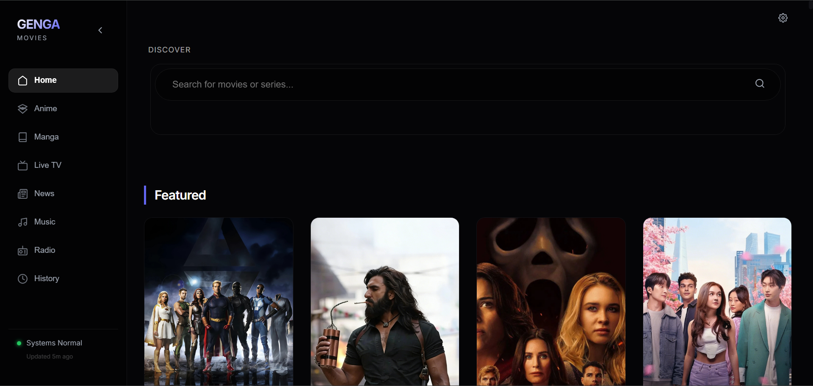 |
| **Live TV** |  |
| **Live Radio** | 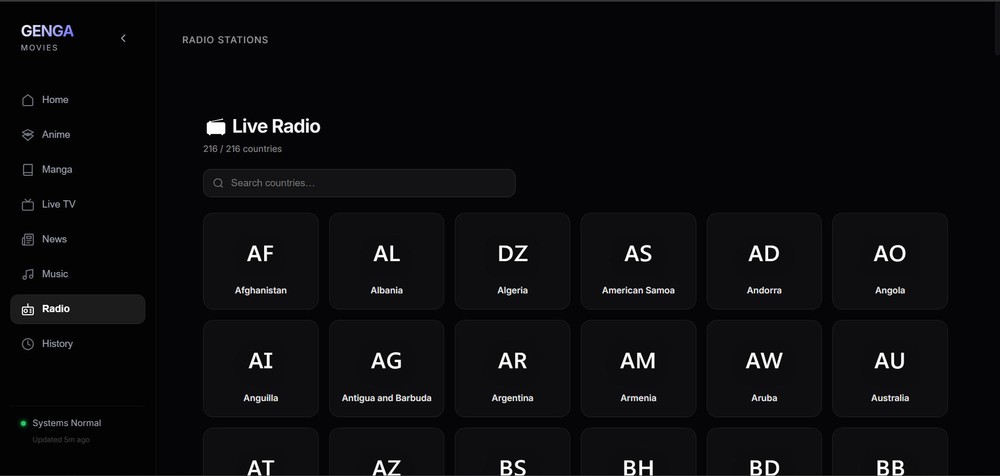 |
| **Anime (Anilist & MegaPlay)** | 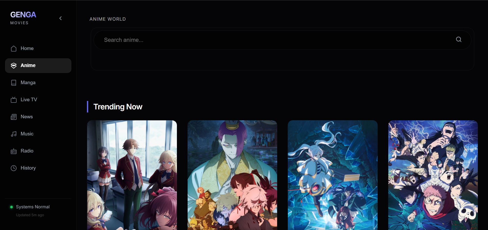 |
| **Manga (Scans)** | 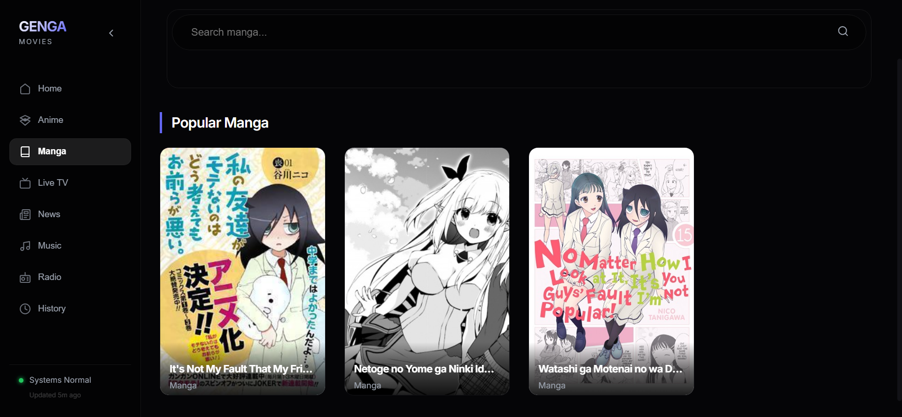 |
| **Music (GaanaPy)** | 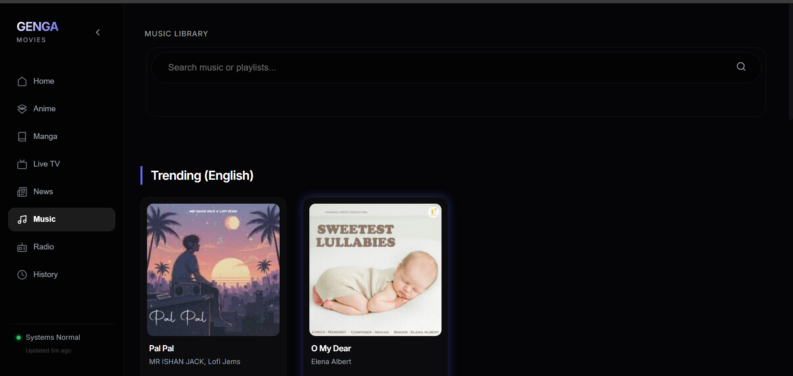 |
| **News (ANN Feed)** | 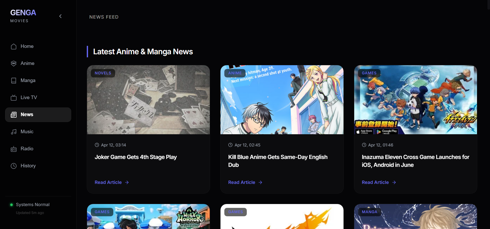 |

---

## 📺 Premium Media Experience

*Feature-rich playback and reading with subtitles, episode management, and immersive readers.*

| Feature | Screenshot |
| :--- | :--- |
| **Anime Player** | 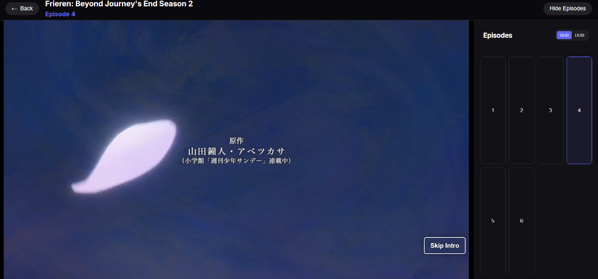 |
| **Home player** | 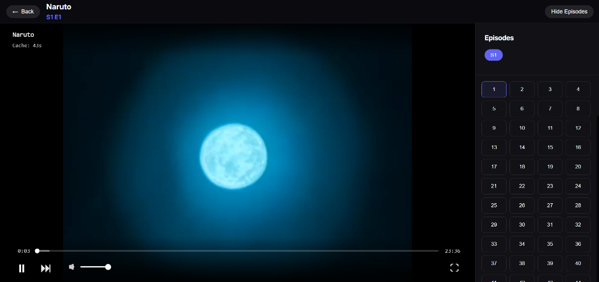 |
| **Live TV Player** |  |
| **Radio Player** | 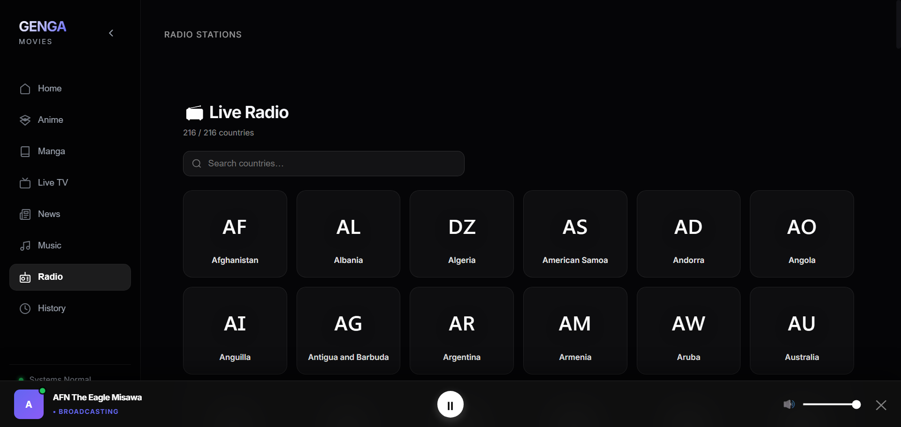 |
| **Manga Reader** | 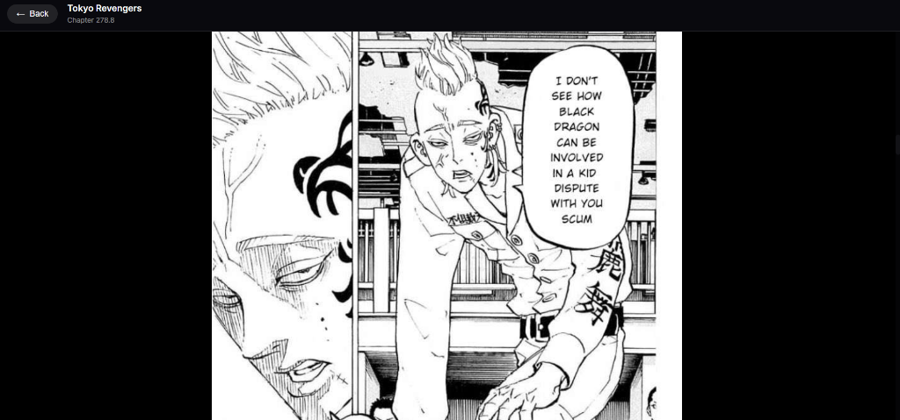 |
| **News Reader** | 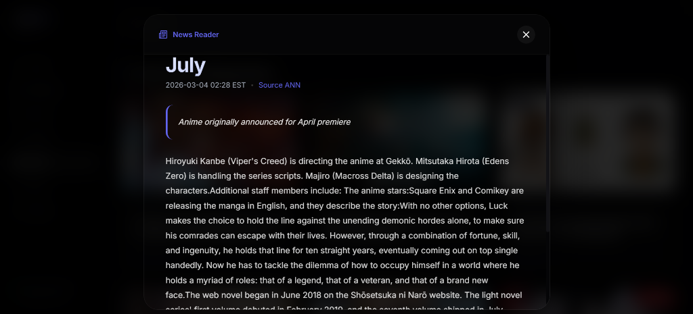 |
| **Music Player** | 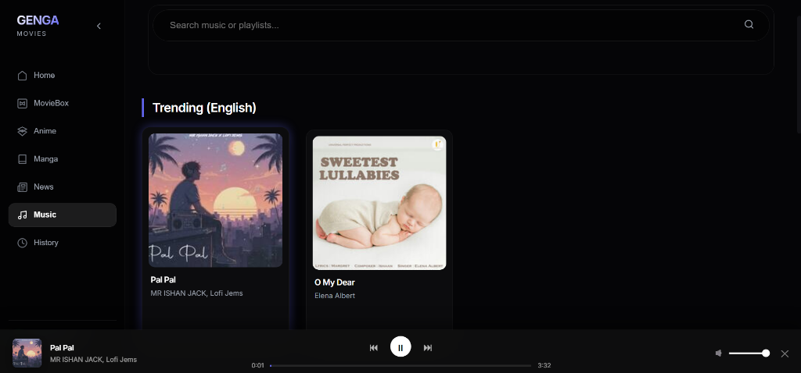 |

---


## 🧰 Tech Stack

**App Shell & Wrapper**
-   **Electron**: Main process wrapper, lifecycle management, CORS/CSP header stripping, custom User-Agent injection.

**Backend Providers**
-   **FastAPI (Python)**: ASGI API provider for MovieBox, CineCLI (YTS), TV (IPTV), Radio, and Anilist anime services.
-   **Node.js (Express Bridge)**: Local scraping endpoints running on port 3001 using `@consumet/extensions` for Manga (MangaPill) and News (ANN).
-   **HTTPX & Axios**: Asynchronous HTTP clients for backend communications.

**Frontend UI**
-   **React 18**: Single-page application library.
-   **Vite**: Build tool and dev server.
-   **CSS Modules**: Component-scoped styling.

---

## 🧠 Architecture & Workflows

### 1. General Movies & Series
*High-quality metadata and direct HTTP streaming.*
-   **How it works**: Combines metadata from TMDB with direct stream links from indexed file hosts.
-   **Stream Button**: Resolves the direct MP4/MKV link and plays it in the integrated player.
-   **Download Button**: Routes the request through the **Backend Download Proxy** (`/api/proxy/download`). This creates a tunnel, allowing you to download files even if the host blocks direct browser downloads (CORS/Referer protection).
-   **Local Server**: Frontend talks to your running `localhost:8000` server. Recommended for maximum speed and proxy capabilities.

### 2. Anilist & MegaPlay (Anime)
*Specialized Anime scraper.*
-   **How it works**: Scrapes episode lists and IDs from Anilist & MegaPlay.
-   **Stream Button**: Instead of a direct file, it loads a third-party **Embed Player** (iframe) inside the app. This ensures 99% availability for anime episodes without complex proxying.

### 3. Manga (Scans)
*Dedicated Manga discovery and reading.*
-   **How it works**: Aggregates manga titles and chapter lists from global databases (Consumet/Mangapill).
-   **Reader**: Integrated image-based reader with **Next/Previous Chapter** navigation and automatic page preloading.
-   **Downloads**: Facilitates direct ZIP downloads of chapters for offline reading.

### 4. Music (Streaming)
*Integrated music playback with chart and playlist support.*
-   **How it works**: Uses the GaanaPy API to search for songs, albums, and popular charts.
-   **Charts & Playlists**: Browse "Hindi Top 50" and other regional charts with full tracklist selection.
-   **Playback**: Direct high-quality streaming links provided by Gaana servers.

### 5. Live TV (Streaming)
*Global TV channels driven completely by the frontend.*
-   **How it works**: The app fetches country and channel metadata directly from the public GitHub repository of Famelack (`famelack-channels`) avoiding any backend API overhead.
-   **Playback (IPTV)**: Standard `.m3u8` links are played natively in the browser using an integrated, low-latency customized `HLS.js` configuration.
-   **Playback (YouTube)**: YouTube live streams bypass iframe restrictions by using the official **YouTube IFrame API** (`YT.Player`). This ensures maximum compatibility for channels that block standard embeds.

### 6. News (Feed)
- 📰 **News Feed:** Stay updated with the latest in anime, movies, and games via combined RSS feeds.

### 7. Live Radio
- **How it works**: Fetches live broadcasts from the Famelack radio dataset.
- **Background Player**: Specialized background audio player allows listening while browsing other sections.

---

## 🔁 Setup & Usage

### Prerequisites
-   Python 3.8+
-   Node.js 16+

### Running the Desktop Application

The application is fully integrated. Launching the desktop shell will automatically start all background services, including the FastAPI backend (port `8000`) and the Node bridge scraper (port `3001`).

```bash
# 1. Install dependencies from the root directory
npm install

# 2. Run the desktop application in development mode
npm run dev:desktop
```

---

### Development Setup (Running Services Individually)

If you are developing or testing parts of the stack separately, you can run them manually:

#### 1. Start the Node Scrape Bridge
```bash
# From the root directory
node node-bridge.js
```
*Runs the bridge server locally at: `http://localhost:3001`*

#### 2. Start the FastAPI Backend
```bash
cd backend
pip install -r requirements.txt
python -m uvicorn main:app --host 127.0.0.1 --port 8000 --reload
```
*Runs the API server locally at: `http://localhost:8000` (Docs available at `http://localhost:8000/docs`)*

#### 3. Start the Frontend Dev Server
```bash
cd frontend
npm install
npm run dev
```
*Runs the dev server locally at: `http://localhost:5173`*

### 📦 Packaging & Building the Production App

Follow these steps to compile the frontend, package the Python backend, and generate the final standalone `.exe` installer.

#### 1. Compile the React Frontend
Builds the static frontend assets into `dist-frontend/`:
```bash
npm run build:frontend
```

#### 2. Package the Python Backend
Make sure you have PyInstaller and Python dependencies installed:
```bash
pip install -r backend/requirements.txt
pip install pyinstaller
```
Compile the backend into a single executable:
```bash
pyinstaller --clean backend.spec
```
Copy the compiled binary into the builder resources directory:
```bash
# Create the directory if it doesn't exist
mkdir dist-backend
# Copy the compiled binary
copy dist\backend.exe dist-backend\backend.exe
```

#### 3. Build the Electron Installer
Generates the final standalone installer executable (`dist/GengaMovie.exe`):
```bash
npm run build:exe
```

---

## ⚙️ Configuration & URLs

### 1. API Ports & Configurations
All scrapers and metadata aggregates communicate locally under the following base settings:

| Service Provider | Port / Location | Mode | Connection Path |
| :--- | :--- | :--- | :--- |
| **FastAPI Backend** | `localhost:8000` | Core Router | Direct API endpoint |
| **Node Scrape Bridge** | `localhost:3001` | Consumet Handler | Proxy endpoint from Backend (8000) to Bridge (3001) |
| **Music (GaanaPy)** | `GaanaPy` library | Native Python integration | Resolved within [music_service.py](file:///d:/Music/iTunes/Downloads/GENGA-MOVIE-DESKTOP/backend/music_service.py) |
| **Manga (MangaPill)** | `localhost:3001` | Express Scraping | Handled by local Node Bridge via [manga_service.py](file:///d:/Music/iTunes/Downloads/GENGA-MOVIE-DESKTOP/backend/manga_service.py) |
| **News (ANN Feed)** | `localhost:3001` | Express RSS Reader | Proxied from FastAPI to Node Bridge via [api.py](file:///d:/Music/iTunes/Downloads/GENGA-MOVIE-DESKTOP/backend/api.py) |

### 2. How it Works (Data Flow)
1. **User Action**: You click on a Manga, Music, or News item.
2. **Frontend Request**: The React SPA sends the request to the FastAPI server: `http://localhost:8000/api/...`
3. **Local Backend Processing**: FastAPI receives the request and resolves it. For Manga or News queries, FastAPI makes a local background fetch to the Node Scraper Bridge running at `http://localhost:3001`.
4. **Data Return**: The resolved payload travels back through port `8000` to your browser view.

---

This software is for educational and research purposes only. The developers of this project do not host, own, or upload any media content. The application acts solely as a client-side interface for existing third-party APIs. Users are responsible for ensuring their usage complies with all applicable local laws and regulations.

## 📄 License

Licensed under the **AGPL-3.0**. See `LICENSE` for details.
